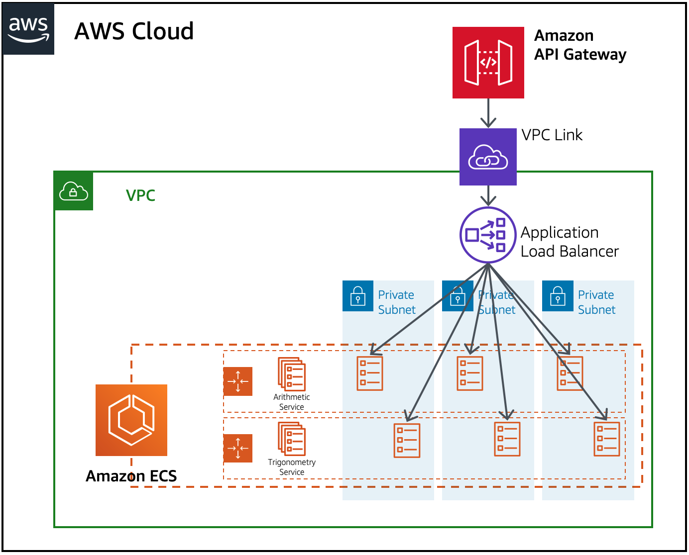

#### *// TODO: Create README*

## Docker build and push to ECR

```sh
aws ecr get-login-password --region {YOUR_Region} | docker login --username AWS \
--password-stdin {YOUR_AccountId}.dkr.ecr.{YOUR_Region}.amazonaws.com

cd arithmetic

docker build -t flask-arithmetic-api-demo .

docker tag flask-arithmetic-api-demo:latest {YOUR_AccountId}.dkr.ecr.{YOUR_Region}.amazonaws.com/flask-arithmetic-api-demo:latest

docker push {YOUR_AccountId}.dkr.ecr.{YOUR_Region}.amazonaws.com/flask-arithmetic-api-demo:latest

cd ../trigonometry

docker build -t flask-trigonometry-api-demo .

docker tag flask-trigonometry-api-demo:latest {YOUR_AccountId}.dkr.ecr.{YOUR_Region}.amazonaws.com/flask-trigonometry-api-demo:latest

docker push {YOUR_AccountId}.dkr.ecr.{YOUR_Region}.amazonaws.com/flask-trigonometry-api-demo:latest
```

## Build AWS environment via CloudFormation

Required parameters:
* ArithmeticImageName - Image/Repo name for Arithmetic service
* TrigonometryImageName - Image/repo name for Trigonometry service

Optional parameters:
* ArithmeticImageTag [DEFAULT: latest] - Image tag for Arithmetic service
* TrigonometryImageTag [DEFAULT: latest] - Image tag for Trigonometry service
* ContainerPort [DEFAULT: 5000] - port the service exposes
* MinTaskCount [DEFAULT: 3] - Minimum number of tasks for each service
* MaxTaskCount [DEFAULT: 6] - Maximum number of tasks for each service
* AutoScalingTargetValue [DEFAULT: 50] - CPU Utilization threshold for auto scaling

```sh
aws s3 mb s3://{YOUR_BucketName}

aws cloudformation package \
--template-file template.yaml \
--s3-bucket {YOUR_BucketName} \
--output-template-file {YOUR_OutputTemplateFile}

aws cloudformation deploy \
--stack-name {YOUR_StackName} \
--template-file {YOUR_OutputTemplateFile} \
--parameter-overrides "ArithmeticImageName=flask-arithmetic-api-demo" \
"TrigonometryImageName=flask-trigonometry-api-demo" \
--s3-bucket {YOUR_BucketName} \
--capabilities CAPABILITY_IAM CAPABILITY_NAMED_IAM
```

## Architecture CloudFormation builds
